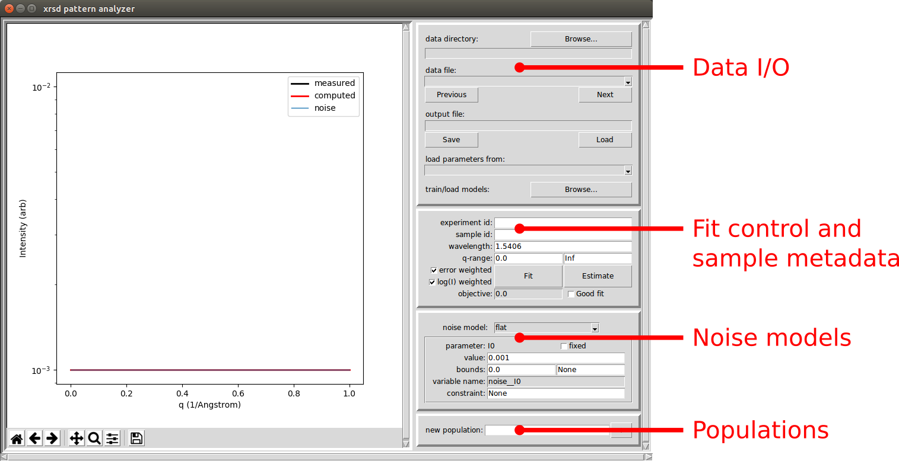

.. _sec-tutorials:

Tutorials
=========

The following four tutorials should be enough 
to get most users started with xrsdkit.
After setup and installation (tutorial 0),
each tutorial includes instructions for using the programming interface 
(for users importing xrsdkit and using it in scripts or notebooks),
followed by the same functionality via the xrsdkit GUI.

Tutorial 0: setup and installation
----------------------------------

1. Get a workable Python 3
..........................

Open a terminal or command prompt,
look for Python,
and check its version.

**Windows** ::

    $ where python
    $ python --version

**Mac/Linux** ::

    $ which python
    $ python --version

If you don't have Python, 
or if your version is less than 3.5.xx,
install a new Python 3 interpreter.

    - Windows: https://www.python.org/downloads/windows/
    - Mac: https://docs.python-guide.org/starting/install3/osx/
    - Linux: use your package manager (yum, apt, rpm, etc.)

2. [Optional] Set up a Python virtual environment
.................................................

A virtual environment is recommended for developers
and for those who need control over their Python environments.
Virtual environments hide your system Python libraries, 
so that you can install Python packages without interfering with existing software.

**Windows** ::

    $ pip install virtualenv 
    $ pip install virtualenvwrapper-win

More info: http://timmyreilly.azurewebsites.net/python-pip-virtualenv-installation-on-windows/

**Mac/Linux** ::

    $ pip install virtualenv 
    $ pip install virtualenvwrapper

You may need to update your shell configuration file
(~/.bashrc or similar) to establish paths for virtual environment files.
More info: http://exponential.io/blog/2015/02/10/install-virtualenv-and-virtualenvwrapper-on-mac-os-x/

3. Install xrsdkit
..................

If using virtual environments, create one: ::

    $ mkvirtualenv xrsdkit

If the virtual environment already exists, activate it: ::

    $ workon xrsdkit

Use pip to install xrsdkit: ::

    $ pip install xrsdkit

Note, you can deactivate the virtual environment later by: ::

    $ deactivate 

4. Check functionality 
......................

To ensure that the package is installed correctly, 
invoke the Python interpreter and import it: ::

    $ python 
    >>> import xrsdkit

For gui usage, start the GUI from the command line: ::

    $ xrsdkit-gui

This should bring up the (empty) GUI.

Note the panels on the right hand side:

    - I/O: Read scattering data and write analysis results.
    - Fit control: Enter sample metadata and control the fitting process.
    - Noise model: Secify a noise model and control its parameters.
    - Populations: Add populations and control their settings and parameters. 

Tutorial 1: data analysis and dataset curation
----------------------------------------------

In this tutorial, a measured pattern is read from a file,
some populations are specified,
and the parameters of the populations 
are optimized to fit the measured intensities.
The results are then visualized and saved to an output file.

For this tutorial to be executed as-written,
`download the xrsdkit-modeling repository <https://github.com/slaclab/xrsdkit_modeling>`_,
and run it from the repository's root directory.

Programming interface
.....................

**Import numpy and some xrsdkit tools** ::

    import numpy as np
    from xrsdkit import system as xrsdsys
    from xrsdkit import visualization as xrsdvis 

**Read the scattering pattern** ::

    q_I = np.loadtxt('my_data/sample_0.dat')
    q = q_I[:,0] 
    I = q_I[:,1] 

This produces two 1-d arrays.
One contains q-values, 
the other contains the corresponding intensities.
If this fails, the data file probably 
does not work nicely with numpy.loadtxt.
This can happen, for example, 
if the data file has a complicated header at the top.
Use whatever method works to read in the data,
as long as the q and I arrays are produced.

The pattern can be now be inspected 
via xrsdkit.visualization functions. ::

    xrsdvis.plot_etc(etc,etc)

**Specify some populations for fitting the pattern** 

Two populations and a flat noise model will be used.
One population is a dilute Guinier-Porod scatterer,
the other is a crystalline arrangement of spheres. ::

    sys = xrsdsys.System(etc,etc,etc)

For more information about how to specify populations, see:

    - :ref:`xrsdkit.system`
    - :ref:`xrsdkit.definitions`

**Fit the parameters objectively and plot the result** ::

    sys_opt = xrsdsys.fit(sys,q,I,source_wavelength)
    mpl_fig, I_comp = xrsdvis.plot_xrsd_fit(sys,q,I,source_wavelength)
    mpl_fig.show()

Graphical interface
...................

In the I/O panel, click the Browse button 
to open the data loader interface.

#.. image:: graphics/gui_init.png

In the data loader, use the Browse button
to find the directory containing the file.

Browse to the directory containing the data file(s).
This will load all of the data files that match the provided regular expression.
Each input data file will be automatically assigned to an output data file,
and the output files will be populated with any information 
entered into the "experiment metadata" input fields.

#.. image:: graphics/gui_init.png

Note: the GUI uses numpy.loadtxt internally,
so GUI users should format their data files accordingly. 

In the GUI, the populations and noise model 
are specified via the widgets on the right-hand side:

The fit is controlled and executed with from the  

After carrying out this process for several samples,
the outputs can be curated in a dataset for training models.
To curate a dataset, use this directory structure:

Graphic: directory structure

Tutorial 2: model training 
--------------------------

In this tutorial, a curated dataset of fit results
is used to train a set of models 
that can be used for automated analysis.
After training the models,
their performance is inspected 
by cross-validation metrics that are collected during training.
To optimize performance,
the training process can be tuned,
the modeling algorithms can be altered,
and the model hyperparameters can be tuned.
After the models are trained, they are saved to disk
so that they can be re-used without re-training.

For this tutorial to be executed as-written,
`download the xrsdkit-modeling repository <https://github.com/slaclab/xrsdkit_modeling>`_,
and run it from the repository's root directory.

Programming interface
.....................

Graphical interface
...................

Tutorial 3: model application 
-----------------------------

In this tutorial, a ready-trained set of models
is used to quickly analyze a few samples of previously unlabeled data.

For this tutorial to be executed as-written,
`download the xrsdkit-modeling repository <https://github.com/slaclab/xrsdkit_modeling>`_,
and run it from the repository's root directory.

Programming interface
.....................

Graphical interface
...................

